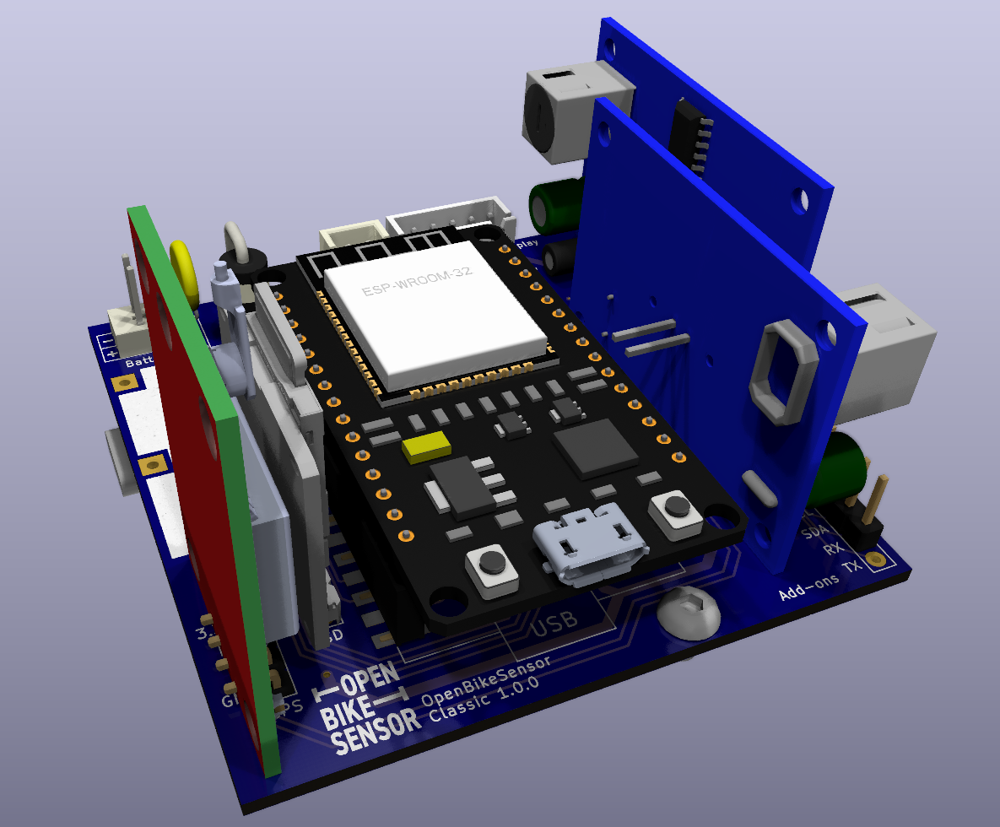

# OpenBikeSensor PCB

Dieses Repository enthält die offiziellen PCBs des OpenBikeSensor Projektes.
Sie sind in der freien Software [KiCad](https://www.kicad.org/) erstellt und
können damit modifiziert werden.

## Versionen

### OpenBikeSensor

Dies ist der Standard-OpenBikeSensor als eigenständiges Gerät, hergestellt aus
vielen fertig verfügbaren Modulen (ESP32 Devkit, GPS, SD-Karten-Modul,
Ultraschallsensor-Module, ...).

Die aktuelle Versionsnummer des OpenBikeSensor Clasic PCB ist `1.0.0`. Den veralteten Repositorystand der Vorversion findest du [hier](https://github.com/openbikesensor/OpenBikeSensor_PCB_Board/tree/00.03.12)

* [Gerber](OpenBikeSensor1.0.0-Gerber.zip)
* [Schaltplan, PDF](./OpenBikeSensor/generated/OpenBikeSensor-1.0.0-schematic.pdf)
* [Bestückungsplan, HTML](./OpenBikeSensor/generated/OpenBikeSensor-1.0.0-ibom.html)

### OpenBikeSensor Lite

In naher Zukunft werden wir hier auch die PCB-Dateien des *OpenBikeSensor Lite*
veröffentlichen. Dies ist ein reduzierter Hardwareaufbau, in welchem nur der
ESP32, die zwei Sensormodule und ein Button enthalten sind, und welcher im
Zusammenspiel mit einem Smartphone die restlichen Daten sammeln kann. Dieses
Projekt ist zur Zeit in der Entwicklung und hoffentlich in der ersten
Jahreshälfte 2023 benutzbar.

### OpenBikeSensor Pro

Diese Variante des OpenBikeSensor ist ein vollständiger Nachbau aller
relevanter Teile der vorher als Modul gelieferten Funktionen in einer eigenen
Schaltung, und ist komplett maschinenbestückt bestellbar. Dies macht das Gerät
teurer und komplizierter herstellen zu lassen, aber es ist ein wesentlich
geringerer Eigenaufwand zur Fertigstellung ohne Löten elektronischer Module
nötig. Dieses Projekt is zur Zeit in der Entwicklung und hoffentlich im Laufe
des Jahres 2023 benutzbar.

## Bestellung bei Platinenherstellern

Ein Export der Projektdateien als "Gerber-Files" liegt im jeweiligen
Projektordner vor. Die meisten Hersteller von Platinen bieten einen
Online-Konfigurator an, in den diese Dateien hochgeladen werden können, und
welcher dann auch eine Vorschau bietet. In der Regel sollten diese Exports für
alle Hersteller funktionieren, die Anforderungen an die Genauigkeit der
Produktion sind relativ gering.

Die Standardeinstellungen für die Platine sind in der Regel vollkommen
ausreichend, das ist üblicherweise ein 2-Layer Board mit einfachem Surface
Finish (HASL) in 1.6mm Stärke (FR-4) und 1oz Kupferstärke. Bessere Optionen (z.
B. ENIG) sind möglich, aber nicht nötig. Die Einstellungen können nach Belieben
angepasst werden, insbesondere ästhetische Aspekte wie die Farbe der Boards.

Einige Hersteller (z. B. Aisler) können die KiCad-Dateien direkt importieren,
hier muss nur die `.kicad_pcb` Datei ausgewählt werden, diese enthält alle
Informationen des Designs.

Bei manchen Herstellern (z. B. JLCPCB) wird die Bestellnummer auf jedes Board
aufgedruckt, für einen kleinen Mehrbetrag kann dies vermieden werden. Gerade
bei größeren Bestellungen fällt diese Gebühr kaum ins Gewicht und ist sehr zu
empfehlen.

## Lizenz

Die eigenen Inhalte dieses Repositories sind lizensiert unter den Bedingungen
der GNU Lesser General Public License. Eine Kopie der Lizenz befindet sich in der
Datei `LICENSE` in diesem Verzeichnis.

Nicht unter diese Lizenz fallen:

* Die folgenden Dateien, welche leichte Modifikationen von Standard-Footprints
  der KiCad-Bibliothek sind und somit unter der entsprechende Lizenz
  ([CC-BY-SA 4.0 mit Modifikationen](https://www.kicad.org/libraries/license/))
  stehen:
    - `libs/OpenBikeSensor.pretty/CP_Radial_D4.0mm_P1.50mm.kicad_mod`
    - `libs/OpenBikeSensor.pretty/Connector_1x02.kicad_mod`
    - `libs/OpenBikeSensor.pretty/Connector_1x04.kicad_mod`
    - `libs/OpenBikeSensor.pretty/Connector_1x05_Display.kicad_mod`
    - `libs/OpenBikeSensor.pretty/Connector_1x06.kicad_mod`

## Update der Exportdateien

Die Dateien in `generated` können mit
[KiBot](https://github.com/INTI-CMNB/KiBot) automatisch aktualisiert werden.
Eine Konfigurationsdatei liegt im jeweiligen Projektverzeichnis vor. Ein
Ausführen von `kibot` im entsprechenden Unterverzeichnis (z. B. `cd
OpenBikeSensor`) erstellt alle Exportdateien neu. Bitte checke nur solche
Dateien in git ein, welche du in deinem Commit auch inhaltlich verändert hast
(z. B. den PDF Schaltplanexport wenn der Schaltplan verändert wurde, aber nicht
wenn nur das PCB Änderungen hat).
